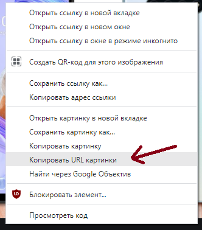
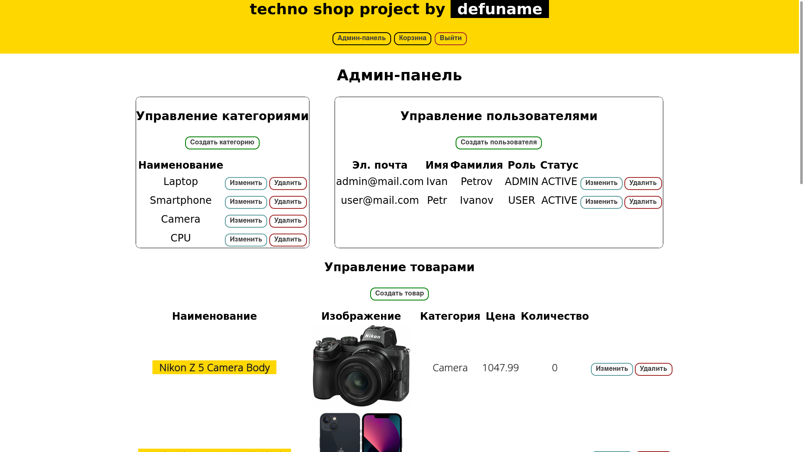
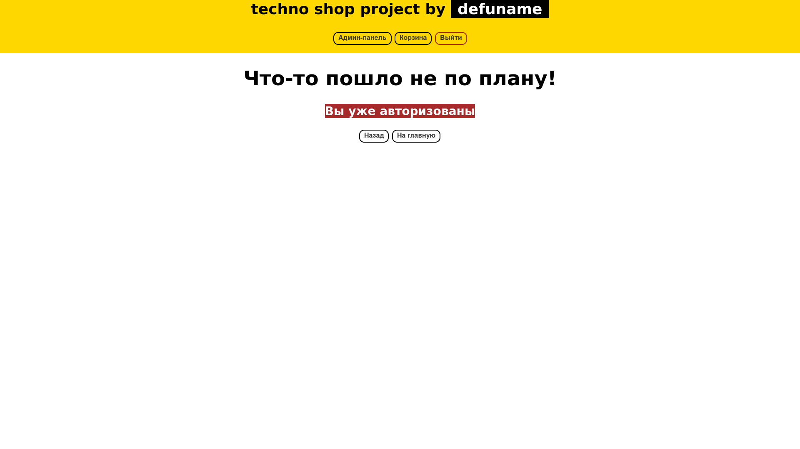

# It's a shop

✅ Реализация интернет-магазина на Spring Boot 3
<p align="center">


<hr>

## Технологии

- Java 21
- Spring framework (Boot, MVC, Rest, Data JPA, Security)
- JUnit (Jupiter) + Mockito
- H2 — БД *(in-memory mode)*
- Thymeleaf + HTML/CSS
- Kafka

## Установка

Клонируем репозиторий (и заходим в его корневой каталог):

```
$ git clone git@github.com:Rubaki21/spring-boot-store.git
``` 

**Собираем проект используя Maven**, пишем:

```
$ mvn clean install
```
**Убедитесь, что используете JDK 21+**

**Локально запускаем:**

```
$ mvn spring-boot:run
```

## Логин

Из коробки приложение имеет двух пользователей:

- `admin@mail.com` : `admin`, права `admin`
- `user@mail.com` : `user`, права `user`

## Инфрастуктура

В корне проекта приложен docker-compose.yaml, который разворачивает всю необходимую инфраструктуру. Для этого необходимо, чтобы работал 
Docker

Развернуть инфраструктуру из корня проекта и подождать 30сек, пока создадутся топики:

```
$ docker compose up -d
```

В инфраструктуре имеется `kafka-ui`, который работает на http://localhost:7777:
Использующиеся topic's можно увидеть во вкладке, <b>Topics</b>
Автоматически создаются 2 топика
1) `out_store.shop_store.products_info`: для загрузки product's
2) `shop_store.out_store.products_info`: результат обработки product's


Важно поднимать инфраструктуру до запуска проекта

## Формат сообщений kafka
1) `out_store.shop_store.products_info`: потребляет Json коллекцию (от 1 до n продуктов). Схема объекта находится по пути 
   `src/main/resources/avro/product.avsc` по которому формируется объект
    - `title`: наименование объекта (обязательное поле)
    - `imageLocation`: ссылка на фотографию (не обязательное поле) 
    - `categoryName`: наименование категории (обязательное поле). Необходимо заполнять наименование из уже имеющихся категорий
    - `price`: цена (обязательный параметр). Стоимость товара с дробной частью
    - `quantity`: количество (не обязательный параметр) 

Пример:

    [
        { "title": "товар 1", "price": "21", "categoryName": "CPU", "quantity":"7" },
        { "title": "товар 2", "price": "22.3", "categoryName": "Camera" }
    ]

2) `shop_store.out_store.products_info`: сюда кладутся результаты обработки product's. Схема объекта находится по пути
   `src/main/resources/avro/result.avsc` по которому формируется объект
   - `result`: результат обработки product
   - `processingTime`: время сохранения product в БД
   - `productInfo`: объект product, который обработали
   - `exceptionMessage`: ошибка обработки, если она была

Пример:
1) успешная обработка

```
{\"result\": true, \"processingTime\": \"2025-07-06 21:43:54\", \"productInfo\": \"{\\\"title\\\": \\\"мой 2 новый товар\\\", 
\\\"imageLocation\\\": null, \\\"categoryName\\\": \\\"CPU\\\", \\\"price\\\": \\\"22\\\", \\\"quantity\\\": 0}\", \"exceptionMessage\": \"\"}
```

2) не успешная обработка

```
 {\"result\": false, \"processingTime\": \"2025-07-06 21:44:05\", \"productInfo\": \"{\\\"title\\\": \\\"мой 1 новый товар\\\", 
   \\\"imageLocation\\\": null, \\\"categoryName\\\": \\\"CP\\\", \\\"price\\\": \\\"21\\\", \\\"quantity\\\": 0}\", \"exceptionMessage\": \"в базе данных отсутствует категория с именем: CP\"}
```

## rest endpoint по которому срабатывает get-request во внешний rest источник и из которого могут быть получены 1 или несколько Product's

Address endpoint: `external/products/fetch`. Для указания внешнего адреса, добавил `enviroment variable`: `EXTERNAL_GET_PRODUCT_URL`

Добавил кнопку вызова `endpoint` в админ панели с названием `Загрузить продукты из внешнего источника`


### Формат external endpoint

Схеме объекта находится по пути `src/main/resources/avro/product.avsc` по которому формируется объект
1. `title`: наименование объекта (обязательное поле)
2. `imageLocation`: ссылка на фотографию (не обязательное поле)
3. `categoryName`: наименование категории (обязательное поле). Необходимо писать наименование из уже имеющихся категорий
4. `price`: цена (обязательный параметр). Стоимость товара с дробной частью
5. `quantity`: количество (не обязательный параметр)

Пример:

    [
        { "title": "товар 1", "price": "21", "categoryName": "CPU", "quantity":"7" },
        { "title": "товар 2", "price": "22.3", "categoryName": "Camera" }
    ]

## Docker

Приложение можно запустить, используя Docker-контейнер.  
Необходимо перейти в корневой каталог проекта и создадим JAR-файл приложения:

```
$ mvn clean package
```

Чтобы создать Docker-образ, воспользуйтесь:

```
$ docker build -t store .
```

Запустите контейнер:

```
$ docker run -d --name store -p8080:8080 store:latest
```

**Готово!** Приложение будет запущено на порту 8080.

Чтобы выключить контейнер с приложением, введите:

```
$ docker stop store
```

### И ещё кое-что

- Запуск происходит локально на порту `8080`
- Доступ к БД можно получить по URL `/h2-console`. Доступ имеют только авторизованные пользователи с правами `admin`
- Данные для входа в БД:
    - URL: `jdbc:h2:mem:store`
    - Логин: `sa`
    - Password:` `  (пароль пустой)  
      
- Картинки в БД хранятся в виде ссылок из интернета. Просто скопируйте ссылку на картинку и вставьте её при создании
  товара  
  

### Скриншоты

<p align="center">

<hr>
<p align="center">

<hr>
<p align="center">

<hr>
<p align="center">

<hr>
